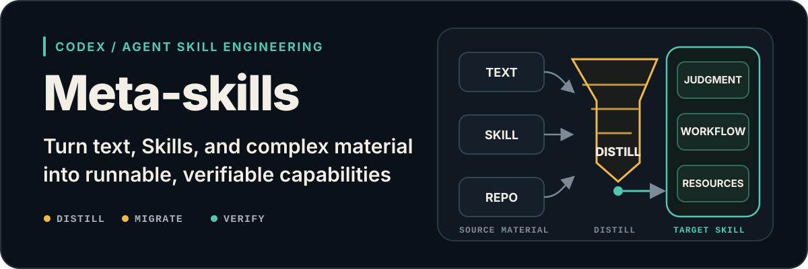
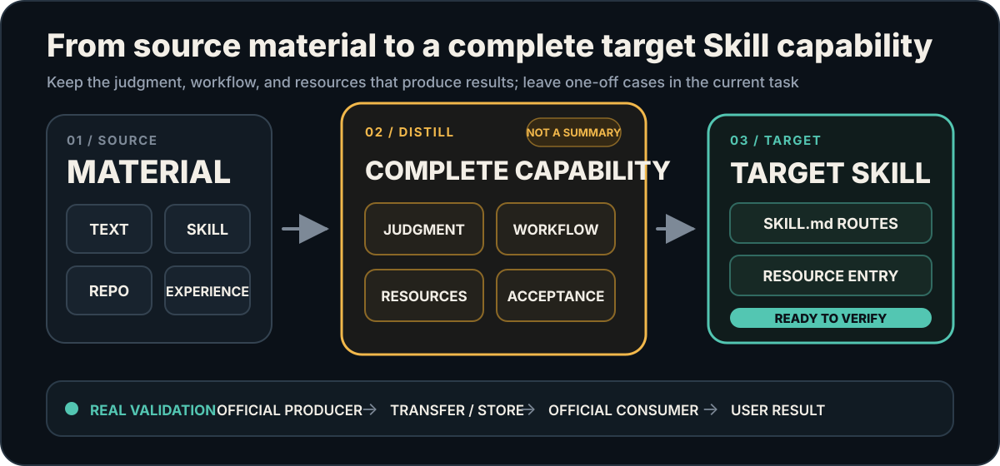

# Meta-skills

<p align="center">
  
</p>

<!-- readme-header:start -->

<p align="center">
  <a href="./README.md">中文</a> · <strong>English</strong> · <a href="./README.ja.md">日本語</a> | <a href="./SKILL.md">Documentation</a> | <a href="./CONTRIBUTING.md">Contributing</a> | <a href="https://github.com/CheshireMew/meta-skills/issues">Feedback</a>
</p>

<p align="center">
  <a href="https://x.com/0xCheshire" title="X"></a>
  <a href="https://t.me/CheshireBTC" title="Telegram"></a>
  <a href="https://blog.blacknico.com/" title="Blog"></a>
  <a href="https://blacknico.com/" title="Homepage"></a>
</p>

<p align="center">
  <a href="https://github.com/CheshireMew/meta-skills/stargazers"></a>
  <a href="https://github.com/CheshireMew/meta-skills/forks"></a>
  <a href="https://github.com/CheshireMew/meta-skills/blob/main/LICENSE"></a>
</p>

<!-- readme-header:end -->

When the delivery approach is not yet decided, Meta-skills can determine whether a capability should be a direct result, a reusable prompt or template, a Skill, a CLI, existing software, or a combination. When a Skill is the right carrier, it can build or improve a complete Codex/Agent Skill, explain why an old one behaves badly, or move a proven way of working into the target without discarding features that still matter.

If Skills are new to you, think of a Skill as a set of instructions that Codex keeps using for a particular kind of work. Meta-skills helps you write, inspect, and upgrade those instructions.

## What it can do for you

| Your situation | What Meta-skills delivers |
| --- | --- |
| You have a goal but have not chosen how to implement it | A recommendation to use a direct result, prompt, Skill, CLI, software, or a combination, with the reasons |
| You have decided that you need a Skill | A usable Skill with its required files and a clear way to invoke it |
| A Skill works sometimes but misses steps or misunderstands requests | A diagnosis, a proposed fix, and an implementation after you approve it |
| A Skill has become hard to maintain | The useful behavior is kept, duplicate rules are combined, and replaced paths are retired |
| Another Skill or project contains a useful method | The result-producing parts are moved over, with licensing and attribution handled correctly |
| You want a Skill to improve from real use | Validated lessons are written back only when you explicitly ask the Skill to learn |
| You want to understand how a Skill works | A diagram from the incoming request to the final user result |

## Quick start

Install it:

```bash
npx skills add CheshireMew/meta-skills
```

If Codex does not show it immediately, restart Codex and check the Skill list again.

Then ask:

```text
Use $meta-skills to inspect <skill-folder> and explain why it is not working well. Show me the problem, the proposed behavior, and the files you would change. Wait for my approval before editing and verifying it.
```

Meta-skills first reads the current Skill and explains the plan in ordinary language. It does not change active files before you approve the plan. After approval, it makes the change and runs the relevant checks.

If the target tracks a remote Git branch, Meta-skills normally validates, commits, and pushes the entire local worktree as one unit, including changes that were already present. It does not selectively leave local changes behind. Say “local changes only” if you do not want any commit or push.

## Common requests

```text
Use $meta-skills to decide whether this capability should be a prompt, Skill, CLI, existing application, or a combination. Explain the reasons and the next step.
```

```text
Use $meta-skills to create a new Skill from these materials. Show me how it will behave before writing files.
```

```text
Use $meta-skills to audit this Skill. Tell me what it currently does and what is wrong, without modifying anything.
```

```text
Use $meta-skills to move the proven method from this project into the target Skill without losing the target's current features.
```

```text
Use $meta-skills to improve the target Skill from this real result so it handles similar requests correctly next time.
```

```text
Use $meta-skills to diagram this Skill from the incoming request to the final result, and mark any connection that is not yet proven.
```

## A concrete example

Suppose you have a writing Skill. It can draft an article, but it sometimes skips source checks, and every attempted fix breaks the output format that already worked. Give that Skill and one real failure to Meta-skills.

It first tells you which existing results must remain, where the problem begins, and what should happen in the future. After you approve the plan, it puts the fix where the Skill will actually use it and updates every affected entry point.

It then checks that the original format still works and that the old rule no longer causes the failure. The failed conversation itself does not become a permanent template.

## How it handles source material

<p align="center">
  
</p>

You do not need to learn this diagram. The process is simple: understand what the target already does, decide what to keep and change, implement the approved design, and verify the result the user actually needs. One-off failures, temporary discussion, and internal review labels do not get copied into the new Skill just because they appeared during the work.

## Boundaries it keeps

- “Simplify this Skill” does not mean silently removing useful behavior.
- An ordinary project task does not automatically become a Skill rewrite. Meta-skills writes lessons back only when you ask it to improve or teach a Skill.
- Copied third-party code, templates, examples, or assets retain their licenses and attribution. Learning a method and implementing it independently does not invent a runtime dependency.
- A file existing, a structural check passing, and a user receiving the desired result are different levels of evidence. Meta-skills reports only what was actually checked.
- Creating a remote repository, changing visibility, force-pushing, and deleting files still require separate permission.

## When you do not need it

If you already know that you only need a one-off result—write an article, analyze data, or fix one function—and you do not need to compare delivery options or create or change a Skill, use the Skill for that domain or ask Codex directly.

## For maintainers

Most users never need the internal documentation. Maintainers can start with [`SKILL.md`](SKILL.md), read the contribution workflow in [`CONTRIBUTING.md`](CONTRIBUTING.md), and follow the repository rules in [`AGENTS.md`](AGENTS.md).

The repository includes four tools: [`init_skill.py`](scripts/init_skill.py) initializes a Skill, [`generate_openai_yaml.py`](scripts/generate_openai_yaml.py) writes its UI metadata, [`quick_validate.py`](scripts/quick_validate.py) checks its structure, and [`self-test-quick-validate.py`](scripts/self-test-quick-validate.py) regression-tests the validator. Run both checks after a change:

```bash
python scripts/quick_validate.py .
python scripts/self-test-quick-validate.py
```

## Star History

<picture>
  <source media="(prefers-color-scheme: dark)" srcset="https://raw.githubusercontent.com/CheshireMew/meta-skills/star-history/star-history-dark.svg">
  <source media="(prefers-color-scheme: light)" srcset="https://raw.githubusercontent.com/CheshireMew/meta-skills/star-history/star-history.svg">
  
</picture>

## License

Original source code, Agent/Codex Skill instructions, scripts, and reusable references in this repository are licensed under the [Mozilla Public License 2.0](LICENSE).

Skills inspected, migrated, or generated for users remain under their authors' terms; third-party components and imported material retain their own licensing boundaries. See [`LICENSING.md`](LICENSING.md) and [`NOTICE`](NOTICE) for the complete scope.
