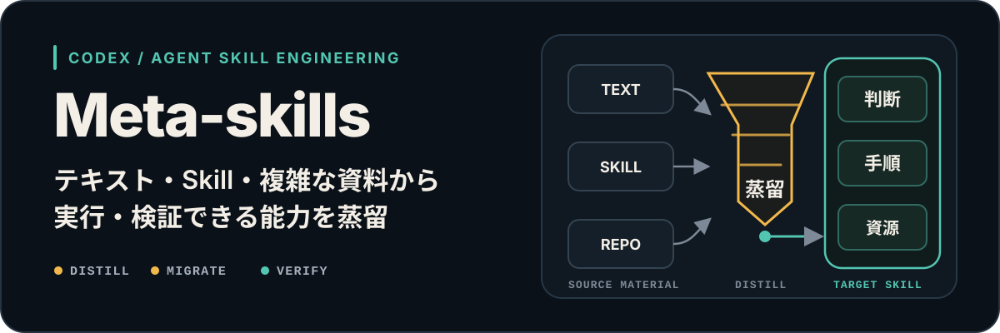
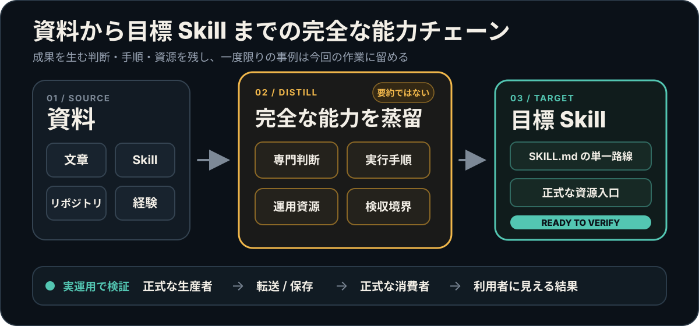

# Meta-skills

<p align="center">
  
</p>

<!-- readme-header:start -->

<p align="center">
  <a href="./README.md">中文</a> · <a href="./README.en.md">English</a> · <strong>日本語</strong> | <a href="./SKILL.md">ドキュメント</a> | <a href="./CONTRIBUTING.md">コントリビューション</a> | <a href="https://github.com/CheshireMew/meta-skills/issues">フィードバック</a>
</p>

<p align="center">
  <a href="https://x.com/0xCheshire" title="X"></a>
  <a href="https://t.me/CheshireBTC" title="Telegram"></a>
  <a href="https://blog.blacknico.com/" title="Blog"></a>
  <a href="https://blacknico.com/" title="Homepage"></a>
</p>

<p align="center">
  <a href="https://github.com/CheshireMew/meta-skills/stargazers"></a>
  <a href="https://github.com/CheshireMew/meta-skills/forks"></a>
  <a href="https://github.com/CheshireMew/meta-skills/blob/main/LICENSE"></a>
</p>

<!-- readme-header:end -->

実現方法がまだ決まっていないとき、Meta-skills は、その能力を一度限りの直接対応、再利用できるプロンプトやテンプレート、Skill、CLI、既存ソフトウェア、またはそれらの組み合わせのどれで実現すべきかを判断します。Skill が適切な手段なら、Codex/Agent Skill を一式作成・改善し、既存 Skill がうまく動かない理由を調べたり、別の場所で実証済みの方法を移したりできます。

Skill が初めての方は、「Codex が特定の仕事をするときに繰り返し使う作業説明書」だと考えてください。Meta-skills は、その説明書を作り、点検し、更新するためのツールです。

## できること

| 状況 | Meta-skills が行うこと |
| --- | --- |
| 目標はあるが実現方法をまだ決めていない | 直接対応、プロンプト、Skill、CLI、ソフトウェア、または組み合わせを選び、理由を説明する |
| Skill が必要だと決めている | 必要なファイルと呼び出し方法を備えた Skill を作る |
| Skill が手順を飛ばしたり、依頼を誤解したりする | 原因と修正案を示し、承認後に修正する |
| 修正を重ねて保守しにくくなった | 役立つ機能を残し、重複をまとめ、置き換え済みの古い入口を終了する |
| 別の Skill やプロジェクトに使いたい方法がある | 結果に必要な部分だけを移し、ライセンスと謝辞も整える |
| 実際の利用結果から Skill を改善したい | 明示的に依頼された場合だけ、検証済みの学びを今後の動作へ反映する |
| Skill の仕組みを把握したい | 依頼を受けてから利用者に結果が届くまでを図にする |

## すぐに始める

インストール：

```bash
npx skills add CheshireMew/meta-skills
```

すぐに Skill 一覧へ表示されない場合は、Codex を再起動して確認してください。

次のように依頼できます。

```text
Use $meta-skills で <skill-folder> が使いにくい理由を調べてください。問題、修正後の動作、変更するファイルを先に説明し、私が承認してから修正と検証を進めてください。
```

Meta-skills は最初に現状を読み、修正案を日常的な言葉で説明します。承認前に活動中のファイルは変更しません。承認後は修正と必要な確認を行います。対象が既存のリモート Git リポジトリにある場合、通常は承認済みの変更をコミットして push するところまで進みます。ローカルだけにしたい場合は、承認時に伝えてください。

## よく使う依頼

```text
Use $meta-skills で、この能力をプロンプト、Skill、CLI、既存ソフトウェア、または組み合わせのどれで実現すべきか判断し、理由と次の手順を説明してください。
```

```text
Use $meta-skills で、この資料から新しい Skill を作ってください。ファイルを書く前に、今後どう動くかを見せてください。
```

```text
Use $meta-skills で、この Skill が現在できることと問題点を監査してください。ファイルは変更しないでください。
```

```text
Use $meta-skills で、このプロジェクトで実証済みの方法を対象 Skill へ移してください。対象 Skill の既存機能は失わないでください。
```

```text
Use $meta-skills で、この実際の結果から対象 Skill を改善し、次回は同じ種類の依頼を正しく処理できるようにしてください。
```

```text
Use $meta-skills で、この Skill が依頼を受けてから結果を返すまでを図にし、証拠のない接続を明示してください。
```

## 具体例

記事を書く Skill があるとします。記事は書けますが、出典確認を飛ばすことがあり、修正するたびに以前から正しかった出力形式まで崩れてしまいます。その Skill と実際の失敗例を Meta-skills に渡します。

Meta-skills は、残すべき結果、問題が最初に起きる場所、今後の正しい動作を先に説明します。承認後、実際に読まれる場所へ修正を入れ、関係する入口を更新し、元の形式が残っていることと、古いルールが同じ失敗を起こさないことを確認します。失敗した会話そのものを恒久的なテンプレートにはしません。

## 資料をどう扱うか

<p align="center">
  
</p>

この図を覚える必要はありません。流れは四つだけです。対象が今できることを確認し、残すものと変えるものを決め、承認済みの修正を行い、最後に利用者が必要な結果を本当に得られるか確認します。一度限りの失敗、途中の議論、内部の検査用語を、そのまま新しい Skill に持ち込むことはありません。

## 守る範囲

- 「簡素化して」という依頼を、役立つ機能を黙って削る理由にはしません。
- 通常のプロジェクト作業が自動的に Skill の書き換えになることはありません。学習や改善を明示的に依頼した場合だけ書き戻します。
- 第三者のコード、テンプレート、例、素材をコピーした場合は、ライセンスと謝辞を残します。方法だけを学んで独自実装した場合、存在しない依存関係を作りません。
- ファイルが存在すること、構造検査に通ること、利用者が目的の結果を得ることは別です。実際に確認した範囲だけを報告します。
- リモートリポジトリの作成、公開範囲の変更、force push、ファイル削除には別の許可が必要です。

## 使わなくてよい場面

記事を一本書く、データを分析する、関数を一つ直すなど、一度限りの結果だけが必要だと分かっていて、実現方法の比較や Skill の作成・変更も必要ない場合、Meta-skills は不要です。その分野を担当する Skill を使うか、Codex に直接依頼してください。

## メンテナー向け

通常の利用では内部文書を読む必要はありません。保守する場合は、入口を [`SKILL.md`](SKILL.md)、貢献手順を [`CONTRIBUTING.md`](CONTRIBUTING.md)、リポジトリ規則を [`AGENTS.md`](AGENTS.md) で確認してください。

リポジトリには四つのツールがあります。[`init_skill.py`](scripts/init_skill.py) は Skill を初期化し、[`generate_openai_yaml.py`](scripts/generate_openai_yaml.py) は UI 情報を生成し、[`quick_validate.py`](scripts/quick_validate.py) は構造を検査し、[`self-test-quick-validate.py`](scripts/self-test-quick-validate.py) は検査器自体を回帰テストします。変更後は次を実行します。

```bash
python scripts/quick_validate.py .
python scripts/self-test-quick-validate.py
```

## Star History

<picture>
  <source media="(prefers-color-scheme: dark)" srcset="https://raw.githubusercontent.com/CheshireMew/meta-skills/star-history/star-history-dark.svg">
  <source media="(prefers-color-scheme: light)" srcset="https://raw.githubusercontent.com/CheshireMew/meta-skills/star-history/star-history.svg">
  
</picture>

## ライセンス

このリポジトリのオリジナルなソースコード、Agent/Codex Skill 指示、スクリプト、再利用可能な reference 文書は [Mozilla Public License 2.0](LICENSE) で提供されます。Meta-skills が監査、移行、生成した利用者の Skill は各作者の条件に従い、第三者コンポーネントと導入資料もそれぞれのライセンス境界を保ちます。完全な範囲は [`LICENSING.md`](LICENSING.md) と [`NOTICE`](NOTICE) を参照してください。
