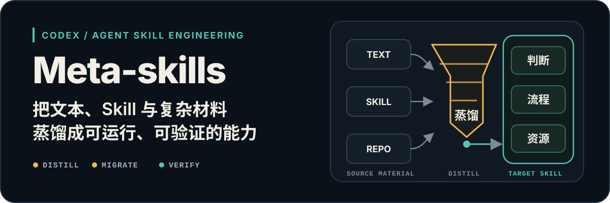
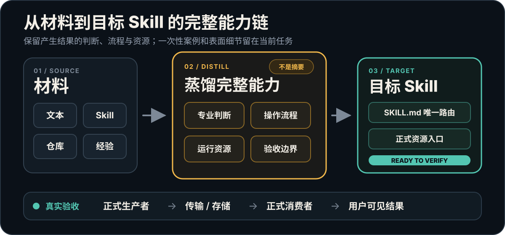

# Meta-skills

<p align="center">
  
</p>

<!-- readme-header:start -->

<p align="center">
  <strong>中文</strong> · <a href="./README.en.md">English</a> · <a href="./README.ja.md">日本語</a> | <a href="./SKILL.md">文档</a> | <a href="./CONTRIBUTING.md">贡献</a> | <a href="https://github.com/CheshireMew/meta-skills/issues">反馈</a>
</p>

<p align="center">
  <a href="https://x.com/0xCheshire" title="X"></a>
  <a href="https://t.me/CheshireBTC" title="Telegram"></a>
  <a href="https://blog.blacknico.com/" title="Blog"></a>
  <a href="https://blacknico.com/" title="Homepage"></a>
</p>

<p align="center">
  <a href="https://github.com/CheshireMew/meta-skills/stargazers"></a>
  <a href="https://github.com/CheshireMew/meta-skills/forks"></a>
  <a href="https://github.com/CheshireMew/meta-skills/blob/main/LICENSE"></a>
</p>

<!-- readme-header:end -->

当一项能力还没确定怎样实现时，Meta-skills 会判断它适合直接完成、写成提示词或模板、使用 Skill、CLI、现有软件，还是组合这些方式。确定 Skill 是合适载体后，它可以创建或改进完整的 Codex/Agent Skill，找出旧 Skill 为什么不好用，或者把一套有效做法迁移进去。

如果你第一次接触 Skill，可以把它理解成“Codex 做某类事情时会长期遵守的工作说明”。Meta-skills 就是用来编写、检查和升级这份说明的工具。

## 它能帮你做什么

| 你的情况 | Meta-skills 会交付什么 |
| --- | --- |
| 只有一个目标，还没确定怎样实现 | 判断应该直接完成、使用提示词、Skill、CLI、软件还是组合方案，并说明理由 |
| 已经确定需要一个 Skill | 创建可安装的 Skill，并补齐使用入口和必要文件 |
| Skill 能用，但经常理解错或漏步骤 | 找到出错的位置，给出修改方案并修好 |
| Skill 越改越乱 | 保留仍然有用的功能，合并重复做法，清掉已经被替代的旧入口 |
| 另一个 Skill 或项目里有值得借鉴的做法 | 只迁移真正产生结果的部分，并处理许可证与致谢 |
| 希望 Skill 从实际使用中进步 | 在你明确要求后，把已经验证的经验写回它以后会用到的位置 |
| 想看清一个 Skill 到底怎样工作 | 画出从收到请求到交付结果的完整流程图 |

## 最快开始

安装：

```bash
npx skills add CheshireMew/meta-skills
```

如果 Codex 没有马上显示它，重启 Codex 后再看 Skill 列表。

安装后可以直接说：

```text
Use $meta-skills 帮我检查 <skill-folder> 为什么不好用。先告诉我问题、准备怎么改、会动哪些文件；等我确认后再修改并验证。
```

Meta-skills 会先读懂现状，再把方案讲清楚。你确认之前，它不会改活动文件；你确认之后，它会完成修改和对应检查。目标 Skill 已有当前跟踪远端时，默认把仓库中全部本地改动作为一个整体验证、提交并推送，不选择性遗漏此前修改；如果你只想改本地，在确认方案时说明即可。

## 常用说法

```text
Use $meta-skills 判断这项能力应该做成提示词、Skill、CLI、使用现有软件，还是组合方案，并说明理由和下一步。
```

```text
Use $meta-skills 根据这些材料创建一个新的 Skill，先给我看它以后会怎样工作。
```

```text
Use $meta-skills 审计这个 Skill，告诉我它现在能做什么、哪里有问题，不要修改文件。
```

```text
Use $meta-skills 把这个项目里已经验证有效的做法迁移到目标 Skill，但不要丢掉目标 Skill 现有功能。
```

```text
Use $meta-skills 根据这次实际结果改进目标 Skill，让它以后遇到同类请求时主动做对。
```

```text
Use $meta-skills 把这个 Skill 的完整工作流程画出来，并标出哪些连接还没有证据。
```

## 一个具体例子

假设你已经有一个写作 Skill。它能写文章，但经常漏掉来源检查，而且每次修复都会顺手改坏原来的输出格式。你可以把这个 Skill 和一次真实失败交给 Meta-skills。

它会先说明哪些现有结果必须保留、问题最早出现在哪里，以及以后应该怎样处理。你确认后，它会把正确做法写到真正会被使用的位置，迁移相关入口，再检查旧格式没有丢、这次的问题也不会继续由旧规则触发。失败过程本身不会被保存成长期模板。

## 它怎样处理材料

<p align="center">
  
</p>

这张图不用背。核心只有四步：先看目标 Skill 现在会什么，再确定应该保留和改变什么，然后完成修改，最后检查用户真正需要的结果能不能得到。它不会为了显得专业，把一次失败、临时讨论或内部检查词汇全都塞进新的 Skill。

## 它会守住的边界

- 改进现有 Skill 时，不会因为“精简”就擅自取消仍然有用的功能。
- 普通项目任务不会自动变成“修改 Skill”；只有你明确要求学习或改进 Skill 时才会写回。
- 直接复制第三方代码、模板、示例或素材时，会保留许可证和致谢；只学习方法并重新实现时，不会把来源假装成运行依赖。
- 文件存在、测试通过和用户真正拿到结果是三件事。它只报告实际检查到的那一层。
- 创建远端、改变仓库可见性、强制推送和删除文件仍然需要单独授权。

## 什么时候不需要它

如果你已经确定只需完成一次普通任务，例如写一篇文章、分析一份数据或修一个函数，也不需要比较实现方式或创建、改变 Skill，就不需要 Meta-skills。直接使用负责那类任务的 Skill 或让 Codex 完成即可。

## 给维护者

日常使用不需要阅读内部文档。需要维护本项目时，从 [`SKILL.md`](SKILL.md) 查看完整入口，从 [`CONTRIBUTING.md`](CONTRIBUTING.md) 查看贡献流程，从 [`AGENTS.md`](AGENTS.md) 查看仓库规则。

项目提供四个工具：初始化 Skill 的 [`init_skill.py`](scripts/init_skill.py)、生成 [`agents/openai.yaml`](agents/openai.yaml) 界面信息的 [`generate_openai_yaml.py`](scripts/generate_openai_yaml.py)、检查 Skill 结构的 [`quick_validate.py`](scripts/quick_validate.py)，以及检查这个结构工具本身的 [`self-test-quick-validate.py`](scripts/self-test-quick-validate.py)。修改后运行：

```bash
python scripts/quick_validate.py .
python scripts/self-test-quick-validate.py
```

## Star History

<picture>
  <source media="(prefers-color-scheme: dark)" srcset="https://raw.githubusercontent.com/CheshireMew/meta-skills/star-history/star-history-dark.svg">
  <source media="(prefers-color-scheme: light)" srcset="https://raw.githubusercontent.com/CheshireMew/meta-skills/star-history/star-history.svg">
  
</picture>

## 许可证

本仓库原创的源代码、Agent/Codex Skill 指令、脚本和可复用 reference 文档采用 [Mozilla Public License 2.0](LICENSE)。Meta-skills 检查、迁移或生成的用户 Skill 继续受其作者自己的条款约束；第三方组件与引入内容也保留各自的授权边界。完整范围见 [`LICENSING.md`](LICENSING.md) 和 [`NOTICE`](NOTICE)。
